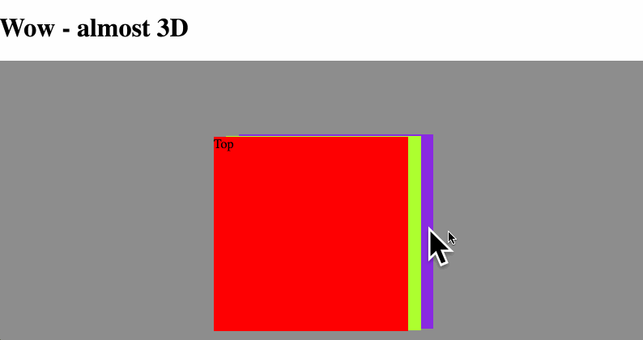

# JS-KATA
## Week 21, Wednesday
### Experimenting with mouse, client and offset coordinates
**The backstory**

You want to implement this cool 3D-like effect:

   
Where the cursor moves the background and foreground around, making it seem like there are some depth in the image.

You quickly realize that the effect is basically three layered `
`-blocks, where only for foreground and background moves. Like this:

So now, the only work left is actually building it. To make it simple, only build the basic-version with colored blocks! However, the same code should work for the graphics-version.

### Your tasks
_As always, the .html, .css, and .js files have been prepared for you - copy everything from materials to mysolution (`cp ./materials/* ./mysolution/`)_

**Important:** The main idea of this task is to learn element positioning with CSS and JavaScript! This is what you should experiment with!

1. Take a look at this documentation: https://msdn.microsoft.com/en-us/library/hh781509(v=vs.85)(VS.85).aspx - yes, it is for Internet Explorer 9, but is surprisingly still valid in all browsers.
2. Open the `3dplanes.js` file, and start following the guide. Stop at every empty line, and do what is just described. Test constantly. Console.log everything

### Additional tasks

* Try different `factor` values for foreground and background
* Try to create your own graphics, make all three layers the same size, remember transparency!